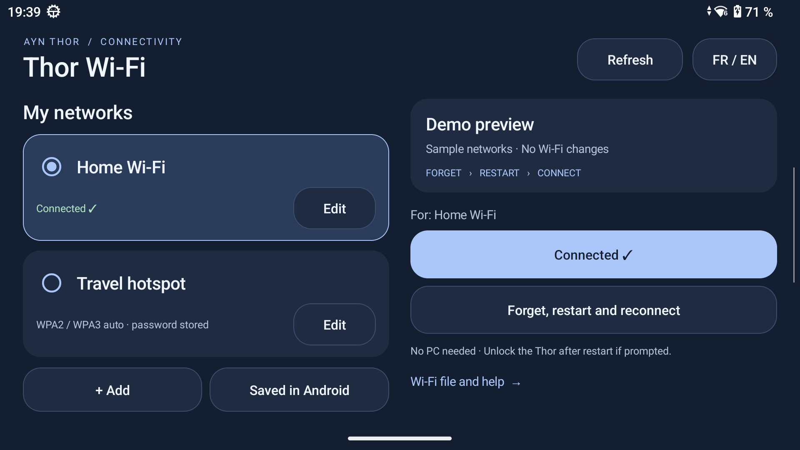
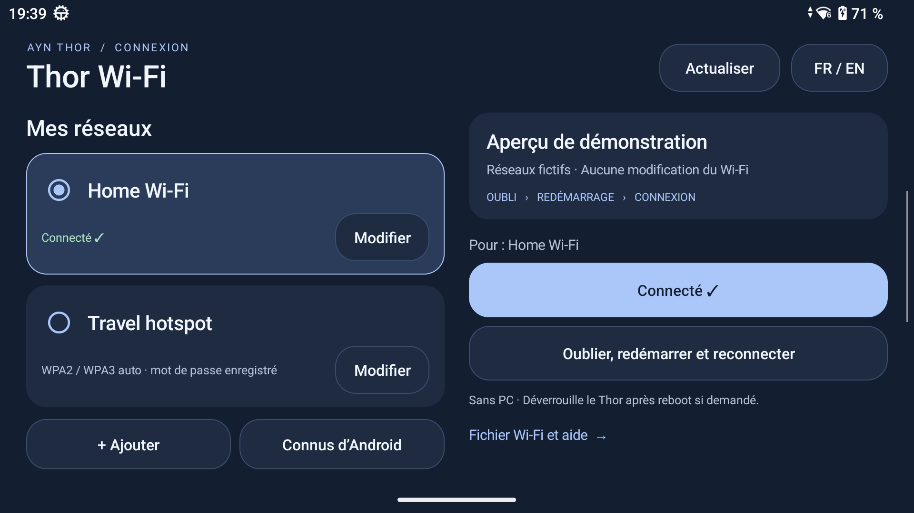

# AYN Thor Wi-Fi Recovery

A small, offline Android utility for the **AYN Thor**: keep your Wi-Fi profiles, select a network, and automate **forget → restart → reconnect** when Wi-Fi gets stuck.

**English and French** are available from the **FR / EN** button. The app also explains what each action does. This is an independent community utility, not an official AYN firmware fix.

[Download the APK](dist/Thor-WiFi-v2.3.apk) · [French guide](docs/README.fr.md) · [Build from source](#build-from-source)

## Why this exists

On the tested Thor, Wi-Fi sometimes stopped discovering or reconnecting to networks and could remain stuck after a normal restart. Diagnostics showed an existing `wlan0` interface and completed driver scans, while Android's Wi-Fi scanning service was stuck. Toggling Wi-Fi and requesting Android Wi-Fi recovery did not resolve that captured incident.

Forgetting the configured network, restarting, then adding it again restored the connection in a real test. This app automates that sequence so you do not have to retype the password. It also offers a normal connection button when a restart is unnecessary.

This is a **workaround**, not proof that every Wi-Fi failure has the same cause. Successful connections on Wi-Fi 6 and Wi-Fi 7 were observed; the app does not change your router's Wi-Fi generation, channel or security mode.

## Screenshots

Real screenshots of the app's read-only demo mode. The network names are fictional; no personal profiles or passwords are shown.




## Installation

1. Copy [Thor-WiFi-v2.3.apk](dist/Thor-WiFi-v2.3.apk) to your Thor and install it. Allow installation from your chosen file manager if Android asks.
2. Open **Thor Wi-Fi** once. The app uses AYN's existing root service to install its bundled scripts. No separate script download, PC, Shizuku or network access is required after installation.
3. Add your network name and Wi-Fi password (WPA2 or WPA3), or pick a name from **Saved in Android**. If the app does not already know that password, enter it once.
4. Select a network and choose **Connect** or **Forget, restart and reconnect**.

Keep the app installed and avoid force-stopping it: Android must be able to deliver its boot event. Unlock the Thor after restarting if prompted. If you have force-stopped the app, open it again before starting another recovery cycle.

## What the buttons do

| Action | Result |
|---|---|
| Add / Edit / Delete | Manages the app's list and its local text file. Deleting here keeps the network saved in Android. |
| Saved in Android | Picks an existing Android SSID; it does not extract Android's stored passwords. |
| Connect | Connects the selected network, without forgetting or restarting. |
| Forget, restart and reconnect | After confirmation, forgets **all networks saved in Android**, verifies removal, restarts, then reconnects the selected profile. The app catalog and its passwords are kept. |
| Refresh | Reloads the local profile file and current Wi-Fi state. |
| FR / EN | Chooses and remembers the interface language. |
| Wi-Fi file and help | Explains the workaround, profile storage and limitations. |

Recovery also works when the selected profile is not saved in Android yet. Android networks absent from the app catalog must be added again if you want to use them later. There is no factory reset and no continuous reboot loop. Reconnection has an outer deadline of 150 seconds per profile. If a background worker disappears, its stale marker is cleared on the next status check or action, after a 15-second launch grace period; the app then reports an interrupted operation and allows retrying. This does not automatically start another reboot.

The manual launchers remain in `Downloads/Thor-Scripts` for **Thor Settings → Run script as root**. The app forgets all Android networks and reconnects one selected profile. The legacy manual script `10_WIFI_OUBLI_REBOOT_AUTO.sh` keeps its narrower behavior: it forgets only profiles listed in the file, then tries those profiles in order.

## Compatibility and limitations

Tested on **AYN Thor, Android 13**, firmware `Thor_V1.0.0.377_20260206_165408_user`, main Android user. The APK requires Android 8 or later, but that minimum alone does **not** establish compatibility with other devices.

The app relies on AYN's `PServerBinder` root interface, the same interface used by **Run script as root**. Availability can vary with firmware. It does not install root, change SELinux mode, unlock the bootloader, or work as a universal Android Wi-Fi repair tool.

Supported authentication: **WPA2-PSK and WPA3-SAE**, selected automatically from scan results and the commands advertised by `cmd wifi help`. Mixed PSK/SAE networks receive a WPA2 connection request; Android may upgrade it to SAE. SAE-only networks receive a WPA3 request. No WPA3 command is sent if the firmware does not advertise it. The detected security is retained locally before recovery, so an empty scan immediately after reboot does not erase that knowledge. Cached scans describe authentication only; a live association and IP address are still required for success. If security has never been observed, recovery stops before forgetting anything. Open Android Wi-Fi settings to discover the network first.

Supported passwords remain 8–63 printable ASCII characters; SSIDs are 1–32 UTF-8 bytes without control characters or leading/trailing spaces. Enterprise, open/OWE, hidden networks and raw 64-character hexadecimal keys are not implemented. Wi-Fi generation and authentication mode are different: this app does not add Wi-Fi 7 radio support to the Thor. Connection to a Wi-Fi 7 router depends on its compatible bands, authentication, and the device firmware.

**Connected ✓** appears on the actually connected profile and on the connection button when that profile is selected. It requires a current SSID association and a global-scope IP address on `wlan0`; it does not claim Internet access. Opening the app and pressing **Refresh** update the state. While a recovery or connection is active, quiet checks update status without disabling controls or rebuilding an unchanged profile list. There is no periodic refresh while idle.

WPA3 also requires compatible Android vendor HAL, driver and firmware; having a shell command alone does not guarantee interoperability. See [Android WPA3 requirements](https://source.android.com/docs/core/connect/wifi-wpa3-owe).

Android reports [802.11be as Wi-Fi standard 8](https://developer.android.com/reference/android/net/wifi/ScanResult#WIFI_STANDARD_11BE) and [SAE as security type 4](https://developer.android.com/reference/android/net/wifi/WifiInfo#SECURITY_TYPE_SAE). These are the values observed in the successful Wi-Fi 7 test.

## Profile storage and privacy

Profiles are local. The APK requests the boot-completed permission and has **no Internet permission**. It contains no personal Wi-Fi configuration, telemetry or account integration.

`Downloads/Thor-Scripts/WIFI_RESEAUX.txt` stores passwords **in plain text** for editing without a PC. A root-private copy with file mode `600` in a `700` directory holds the selected profile for reboot recovery. The editor masks passwords by default and allows explicitly revealing them. This is not encrypted password-vault storage.

The app reads the file as literal text; it never evaluates it as shell code. Its root Binder commands use fixed paths, not interpolated passwords. The Android `cmd wifi connect-network` process necessarily receives the password as an argument; the scripts suppress its output, but cannot guarantee what privileged firmware logging might capture.

Share the APK or this source repository. **Do not share your profile file, private signing key, or unreviewed device logs.**

## Verification performed

Version 2.3: upgrading the actual Thor cleared an orphaned recovery marker whose worker had disappeared. A new all-network recovery started through the app, rebooted the device and reconnected through the boot receiver with global IP addresses. The profile file was unchanged and both pending/working markers were gone. No PC resume command was used. An idle observation confirmed that snapshots no longer repeat automatically. Guard tests cover stale, fresh, live-worker and absent markers.

Version 2.2: all-network recovery was launched from the real app and the boot receiver reconnected the chosen profile with an IP address. The app catalog was unchanged. A separate SAE-only profile initially received authentication rejections, then connected after its stored profile was updated. Android reported security type `4` (SAE), Wi-Fi standard `8` (802.11be / Wi-Fi 7), frequency 5975 MHz, and global IP addresses. This is one observed Wi-Fi 7 / WPA3 connection on the tested firmware, not a guarantee for every router. The full reboot-recovery test and the separate Wi-Fi 7 connection test are distinct checks.

- Real-device add, select, edit and delete via UI instrumentation using a temporary fictional profile; the original list was restored.
- Real-device normal connection, and a complete recovery cycle launched through the app, with association and IP address confirmed after boot. The boot receiver performed recovery; no PC reconnect/resume command was issued after reboot.
- The USB cable remained attached for observation. A physically disconnected cable test was not performed.
- French/English resource parity, language switching and help checked on the Thor. Screenshots use demo mode, which skips root setup, profile loading and mutations.
- Isolated tests cover literal passwords, malformed profiles, empty catalogs, exact SSID matching, WPA2/WPA3 selection, cached security across an empty reboot scan, all-network recovery, preservation of the catalog, legacy scoped recovery, failure before reboot, and the stability of pending recovery credentials.
- APK signing verified; local backup and installed APK hashes compared.

These checks establish the observed connection and IP result, not Internet reachability, every game/device interaction, or a permanent firmware fix.

## Build from source

Requires Windows, PowerShell 7, JDK 17+, Android API 33 `android.jar`, Android build-tools providing `aapt`, `zipalign` and `apksigner`, and an R8/D8 jar. The build script does not download dependencies.

```powershell
./build.ps1 -JavaHome 'C:\Android\jdk' `
  -BuildTools 'C:\Android\sdk\build-tools\34.0.0' `
  -AndroidJar 'C:\Android\sdk\platforms\android-33\android.jar' `
  -R8Jar 'C:\Android\r8.jar'
```

Output: `../Build/Thor-WiFi.apk`. If no `-KeyStore` is supplied, a local development signing key is generated in the build directory (alias `thor-local`, development password `changeit`). Keep that key private and reuse it for updates. A different key cannot update an existing installation signed by another key. The private key for the distributed APK is not included.

Reference toolchain: JDK 20, API 33, build-tools 34.0.0, R8 8.7.18. Native Android views and local shell scripts only.

### Tests

The Python shell tests use Git for Windows Bash and do not contact a device:

```powershell
python tests/verify_app_api.py
python tests/verify_workflow.py
python tests/verify_scripts.py
```

`tests/NetworkStoreTest.java` runs the Android-independent profile parser tests; `tests/WifiStateTest.java` checks live connection labels, including association without an IP and stale addresses. `tests/UiTestRunner.java` is a separate Android instrumentation test, excluded from the distributed APK. It uses temporary dummy profiles, not real passwords.

### Layout

- `java/`: UI, translation lookup, profile parser, fixed AYN bridge and boot receiver.
- `res/values/`, `res/values-fr/`: English and French text.
- `assets/install.sh`: installs the bundled engines while preserving existing profiles.
- `assets/engine/`: catalog API, targeted recovery, connection and diagnostics.
- `assets/launchers/`: one-line Thor Settings launchers.
- `dist/`: signed installable APK and SHA-256 checksum.

## Feedback

For useful bug reports, include the Thor firmware version, the action used and whether the app reports an association/IP result. Review logs before attaching them: SSIDs, MAC/IP addresses and other metadata may be present.

## License

MIT. This project is independent of AYN and Android/AOSP. Names and trademarks belong to their respective owners.
